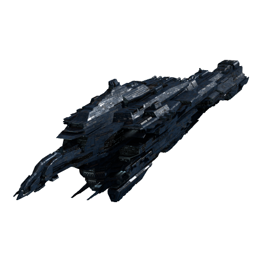

# Leviathan EVE Online Discord Bot WIP

Leviathan is bot for EVE Online authorization, including tickers and character names with filters

 

## Build and Run requirements

- **Visual Studio 2022** or **Rider** for changing code
- **.NET 6 SDK** for building
- **Docker Engine** and **Docker Compose** for running in container

### Set up your discord bot

- Build or/and deploy your **docker-compose.yml** file and set up your own **settings.json** file
- How to compile or pull from release - https://github.com/TheBottleCyber/LeviathanBot/wiki/Build-&-Installation
- How to find what data you are need for bot - https://github.com/TheBottleCyber/LeviathanBot/wiki/How-to-get-all-required-data-for-settings
- How to setup your own **settings.json** file - https://github.com/TheBottleCyber/LeviathanBot/wiki/Configure-settings.json

### Advantages
- **.NET Core 6** powered multi-platform support (Win, Linux, Mac, etc.) using the latest technologies
- **SQLite** database with **Enitity Framework Core**, **ESI.NET** package for **EVE Online ESI** API requests, **Quartz** for delaying jobs and **Discord.Net** package for discord API
- Only **three buttons** for getting discord roles **no needs to write anything** in the discord channel
- Customizable **settings.json** file
- Allow only **authed** ingame characters into your Discord group
- Multiply discord roles with one of the filters
- Filters works for **character names**, **corporations** and **alliances**
- Open for **issues** and **pull requests**